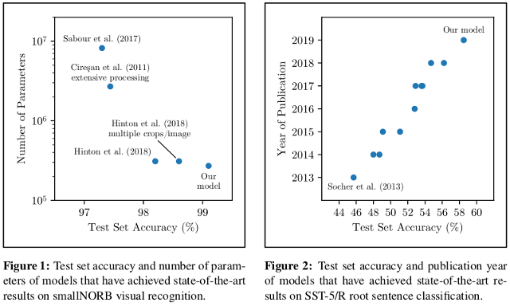
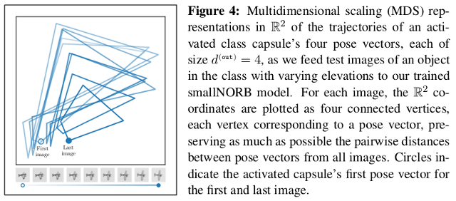

# heinsen_routing

Official implementation of "[An Algorithm for Routing Capsules in All Domains](https://arxiv.org/abs/1911.00792)" (Heinsen, 2019) in PyTorch. This learning algorithm, _without change_, achieves state-of-the-art results in two domains, vision and language.

For example, a capsule network using this algorithm outperforms [Hinton et al. (2018)](https://ai.google/research/pubs/pub46653)'s capsule network on a visual task using _fewer parameters_ and requiring _an order of magnitude less training_. A capsule network using the same algorithm outperforms [BERT](https://arxiv.org/abs/1810.04805) on a language task. In both of these examples, the same training regime was used to train the model (same hyperparameters, learning rate schedule, regularization, etc.).

You can easily add the algorithm as a new layer to any model to improve its performance. Try it!

## Sample usage

Detect objects from their component parts in images:

```python
from heinsen_routing import Routing

part_scores = torch.randn(100)       # 100 scores, one per detected part
part_poses = torch.randn(100, 4, 4)  # 100 capsules, each a 4 x 4 pose matrix

detect_objs = Routing(d_cov=4, d_inp=4, d_out=4, n_inp=100, n_out=10)
obj_scores, obj_poses, obj_poses_sig2 = detect_objs(part_scores, part_poses)

print(obj_scores)                    # 10 scores, one per detected object
print(obj_poses)                     # 10 capsules, each a 4 x 4 pose matrix
```

Classify sequences of token embeddings:

```python
from heinsen_routing import Routing

tok_scores = torch.randn(n)          # token scores, n is variable
tok_embs = torch.randn(n, 1024)      # token embeddings, n is variable
tok_embs = tok_embs.unsqueeze(1)     # reshape to n x 1 x 1024 (n matrices)

classify = Routing(d_cov=1, d_inp=1024, d_out=8, n_out=2)  # variable n_inp
class_scores, class_embs, class_embs_sig2 = classify(tok_scores, tok_embs)

print(class_scores)                  # 2 scores, one per class
print(class_embs)                    # 2 capsules, each a 1 x 8 matrix
```

Predict variable numbers of targets:

```python
from heinsen_routing import Routing

attr_scores = torch.randn(10)        # 10 scores
attr_caps = torch.randn(10, 1, 256)  # 10 capsules with 1 x 256 features

predict = Routing(d_cov=1, d_inp=256, d_out=64, n_inp=10)  # variable n_out
pred_scores, pred_caps, pred_caps_sig2 = predict(attr_scores, attr_caps, n_out=n)

print(pred_scores)                   # n scores, one per prediction
print(pred_caps)                     # n capsules with 1 x 64 features
```

## Installation

1. Download one file: [heinsen_routing.py](heinsen_routing.py).
2. Import the module: `from heinsen_routing import Routing`.
3. Use it as shown above.

Note: requires a working installation of [PyTorch](https://pytorch.org).

## Why?

Initial evaluations show that our learning algorithm, without change, achieves state-of-the-art results in two domains, vision and language. In our experience, this is unusual, and therefore worthy of attention and further research:

> 

Moreover, we find evidence that our learning algorithm, when we apply it to a visual recognition task, _learns to perform a form of "reverse graphics."_ The following visualization, from our [paper](https://arxiv.org/abs/1911.00792), shows a two-dimensional approximation of the trajectories of the pose vectors of an activated class capsule as we change viewpoint elevation of the same object from one image to the next:

> 

Our algorithm is a new, general-purpose form of "routing by agreement" ([Hinton et al., 2018](https://ai.google/research/pubs/pub46653)) which uses expectation-maximization (EM) to cluster similar votes from input capsules to output capsules in a layer of a neural network. A capsule is a group of neurons whose outputs represent different properties of the same entity in different contexts. Routing by agreement is an iterative form of clustering in which each output capsule detects an entity by looking for agreement among votes from input capsules that have already detected parts of the entity in a previous layer.

## Replication of results in paper

If you wish to replicate our results, we recommend recreating our setup in a virtual Python environment, with the same versions of all libraries and dependencies. Runing the code requires at least one Nvidia GPU with 11GB+ RAM, along with a working installation of CUDA 10 or newer. The code is meant to be easily modifiable to work with greater numbers of GPUs, or with TPUs. It is also meant to be easily modifiable to work with frameworks other than PyTorch (as long as they support Einsten summation notation for describing multilinear operations), such as TensorFlow.

To replicate our environment and results, follow these steps:

1. Change to the directory in which you cloned this repository:

```
cd /home/<my_name>/<my_directory>
```

2. Create a new Python 3 virtual environment:

```
virtualenv --python=python3 python
```

3. Activate the virtual environment:

```
source ./python/bin/activate
```

4. Install required Python libraries in environment:

```
pip install --upgrade pip
pip install --upgrade -r requirements.txt
```

5. Install other dependencies:

```
mkdir deps
git clone https://github.com/glassroom/torch_train_test_loop.git deps/torch_train_test_loop
git clone https://github.com/ndrplz/small_norb.git deps/small_norb
```

6. Download and decompress smallNORB files:

```
mkdir .data
mkdir .data/smallnorb
cd .data/smallnorb
wget https://cs.nyu.edu/~ylclab/data/norb-v1.0-small/smallnorb-5x46789x9x18x6x2x96x96-training-dat.mat.gz
wget https://cs.nyu.edu/~ylclab/data/norb-v1.0-small/smallnorb-5x46789x9x18x6x2x96x96-training-cat.mat.gz
wget https://cs.nyu.edu/~ylclab/data/norb-v1.0-small/smallnorb-5x46789x9x18x6x2x96x96-training-info.mat.gz
wget https://cs.nyu.edu/~ylclab/data/norb-v1.0-small/smallnorb-5x01235x9x18x6x2x96x96-testing-dat.mat.gz
wget https://cs.nyu.edu/~ylclab/data/norb-v1.0-small/smallnorb-5x01235x9x18x6x2x96x96-testing-cat.mat.gz
wget https://cs.nyu.edu/~ylclab/data/norb-v1.0-small/smallnorb-5x01235x9x18x6x2x96x96-testing-info.mat.gz
for FILE in *.gz; do gunzip -k $FILE; done
cd ../..
```

7. Run the Jupyter notebooks:

Make sure the virtual environment is activated beforehand. Also, you may want to modify the code to use more than one GPU device (recommended). You can run the notebooks non-interactively or interactively:

* To run the notebooks non-interactively, use `jupyter nbconvert --execute`, optionally specifying whether you want the output, including visualizations, in nicely formatted html, pdf, or some other format. See [these instructions](https://nbconvert.readthedocs.io/en/latest/usage.html).

* To run the notebooks interactively, run `jupyter notebook`. You should see two notebooks that replicate the results in our paper. Open and run them using the Jupyter interface.

The results shown in the paper were obtained by training each model 10 times and using the end-of-training snapshot with the lowest validation error for testing. Some variability in training is normal, because each output capsule must learn to execute an expectation-maximization (EM) loop, which is known to be [sensitive to initialization](https://www.google.com/search?q=em+algorithm+initialization). As we mention in the paper, you may be able to obtain better performance with more careful tweaking of layer sizes and training regime.

## Pretrained weights

We have made pretrained weights available for the smallNORB and SST models:

```python
import torch
from models import SmallNORBClassifier, SSTClassifier

# Load pretrained smallNORM model.
model = SmallNORBClassifier(n_objs=5, n_parts=64, d_chns=64)
model.load_state_dict(torch.load('smallNORB_pretrained_model_state_dict.pt'))

# Load SST model pretrained on binary dataset.
model = SSTClassifier(d_depth=37, d_emb=1280, d_inp=64, d_cap=2, n_parts=64, n_classes=2)
model.load_state_dict(torch.load('SST2R_pretrained_model_state_dict.pt'))

# Load SST model pretrained on fine-grained dataset.
model = SSTClassifier(d_depth=37, d_emb=1280, d_inp=64, d_cap=2, n_parts=64, n_classes=5)
model.load_state_dict(torch.load('SST5R_pretrained_model_state_dict.pt'))
```

## Notes

Our paper is still work-in-progress, subject to revision. Comments and suggestions are welcome!  We typeset the paper with the ACL conference's LaTeX template for no other reason than we find its two-column format, with fewer words per line, easier to read. We briefly considered submitting our work to an academic conference, but by the time we had finished running illustrative evaluations on academic datasets, documenting and writing up the results, and removing all traces of internal code, the deadline for NIPS had passed and we didn't want to wait much longer. We decided to post everything here and let the work speak for itself.

We have tested our code only on Ubuntu Linux 18.04 with Python 3.6+.

## Citing

If our work is helpful to your research, please cite it:

```
@misc{heinsen2019algorithm,
    title={An Algorithm for Routing Capsules in All Domains},
    author={Franz A. Heinsen},
    year={2019},
    eprint={1911.00792},
    archivePrefix={arXiv},
    primaryClass={cs.LG}
}
```

## How is this used at GlassRoom?

We conceived and implemented this routing algorithm to be a component (i.e., a layer) of larger models that are in turn part of our AI software, nicknamed Graham. Our implementation of the algorithm is designed to be plugged into or tacked onto existing PyTorch models with minimal hassle.

Most of the original work we do at GlassRoom tends to be either proprietary in nature or tightly coupled to internal code, so we cannot share it with outsiders. In this case, however, we were able to isolate our code and release it as stand-alone open-source software without having to disclose any key intellectual property.

We hope others find our work and our code useful.
