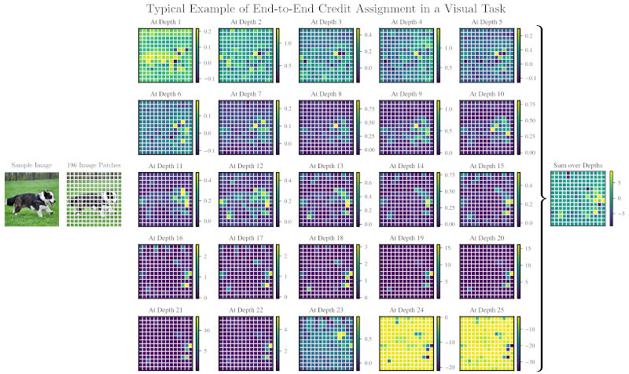

# heinsen_routing

Reference implementation of the routing algorithm proposed in "[An Algorithm for Routing Vectors in Sequences](https://arxiv.org/abs/2211.11754)" (Heinsen, 2022), and an earlier variant, "[An Algorithm for Routing Capsules in All Domains](https://arxiv.org/abs/1911.00792)" (Heinsen, 2019), for composing deep neural networks.

A toy example is helpful for conveying quickly what the algorithm does:

```python
import torch
from heinsen_routing import EfficientVectorRouting as Routing

model = torch.nn.Sequential(
    Routing(n_inp=10000, n_out=1000, d_inp=1024, d_out=2048),
    Routing(n_inp= 1000, n_out= 100, d_inp=2048, d_out=3072),
    Routing(n_inp=  100, n_out=  10, d_inp=3072, d_out=4096),
)

x_inp = torch.randn(10_000, 1024)  # 10,000 vectors of size 1024
x_out = model(x_inp)               # 10 vectors of size 4096
```

## Table of Contents

* [Installing](#installing)

* [How Does it Work?](#how-does-it-work)

* [Variants of the Algorithm in this Repository](#variants-of-the-algorithm-in-this-repository)
  * [EfficientVectorRouting](#efficientvectorrouting)
  * [DefinableVectorRouting](#definablevectorrouting)
  * [GenerativeMatrixRouting](#generativematrixrouting)

* [Sample Usage of EfficientVectorRouting](#sample-usage-of-efficientvectorrouting)
  * [Sequence to Sequence](#sequence-to-sequence)
  * [Sequence to Vector](#sequence-to-vector)
  * [Routing Sequences of Varying Length](#routing-sequences-of-varying-length)
  * [Routing Very Long Sequences](#routing-very-long-sequences)
  * [Recurrent Routings](#recurrent-routings)
  * [Composable Credit Assignments](#composable-credit-assignments)

* [Frequently Asked Questions](#frequently-Asked-Questions)

* [Replicating Published Results](#replicating-published-results)

* [Notes](#notes)

* [Citing](#citing)


## Installing

```
pip install git+https://github.com/glassroom/heinsen_routing
```

Alternatively, you can download a single file to your project directory: [heinsen_routing.py](heinsen_routing/heinsen_routing.py).

The only dependency is PyTorch.


## How Does it Work?

Our routing algorithm takes a sequence of `n_inp` input capsules and computes a new sequence of `n_out` output capsules. A capsule is a group of artificial neurons, such as a vector or a matrix, representing the properties of an entity in a context (e.g., a word in a paragraph, an object in an image, a topic in a conversation). Each input and output capsule represents a different entity.

The algorithm is iterative. In each iteration, we update the state of all output capsules in parallel. Each output capsule maximizes "bang per bit," or the difference between a net benefit to use and net cost to ignore data, by better explaining (e.g., predicting, generating) the input capsules. The output sequence's final state maximizes "bang per bit" by best explaining the input sequence.


## Variants of the Algorithm in this Repository

This repository contains three variants of our routing algorithm, implemented as PyTorch modules:

### EfficientVectorRouting

`EfficientVectorRouting` is the efficient implementation proposed in "[An Algorithm for Routing Vectors in Sequences](https://arxiv.org/abs/2211.11754)" (Heinsen, 2022). It incorporates optimizations that reduce parameter count, memory use, and computation by orders of magnitude compared to the other two variants, making it the best choice for most use cases. This README focuses primarily on this PyTorch module. *If you're not sure which module you should use, we recommend this one.* [See the next section for sample usage](#sample-usage-of-efficientvectorrouting).

### DefinableVectorRouting

`DefinableVectorRouting` implements the general form of "[An Algorithm for Routing Vectors in Sequences](https://arxiv.org/abs/2211.11754)" (Heinsen, 2022). It requires you to define, instantiate, and pass at initialization four PyTorch modules named A, F, G, and S (corresponding to neural networks A, F, G, and S in the paper), which specify routing behavior. In principle, you could define A, F, G, and S to replicate `EfficientVectorRouting`'s behavior -- but not its optimizations. See the module's docstring for sample usage.

### GenerativeMatrixRouting

`GenerativeMatrixRouting` implements the original variant, "[An Algorithm for Routing Capsules in All Domains](https://arxiv.org/abs/1911.00792)" (Heinsen, 2019). It routes matrices as the capsules, and uses Gaussian mixture models to generate the output matrices, weighted by separate activations that maximize "bang per bit." This module is the least scalable of the three, so we now recommend using it mainly for small-scale tasks. See the module's docstring for sample usage.


## Sample Usage of EfficientVectorRouting

### Sequence to Sequence

`EfficientVectorRouting` takes a sequence of input vectors `[..., n_inp, d_inp]` and computes a sequence of output vectors `[..., n_out, d_out]`, where "`...`" denotes zero or more preserved dimensions. Each vector is a capsule representing a different entity. The output sequence maximizes "bang per bit" by best predicting (i.e., explaining) the given input sequence:

```python
import torch
from heinsen_routing import EfficientVectorRouting as Routing

batch_sz = 4
n_inp, d_inp = (2000, 1024)  # input seqs will have 2000 vectors of size 1024
n_out, d_out = (1000, 2048)  # we will route them to 1000 vectors of size 2048

model = Routing(n_inp=n_inp, n_out=n_out, d_inp=d_inp, d_out=d_out)

x_inp = torch.randn(batch_sz, n_inp, d_inp)  # shape is [batch_sz, n_inp, d_inp]
x_out = model(x_inp)                         # shape is [batch_sz, n_out, d_out]
```


### Sequence to Vector

If you set `d_out` equal to 1, `EfficientVectorRouting` routes each sequence of input vectors to a sequence of one-dimensional vectors, or scalars, which you can concatenate into a single vector. Each scalar value is a capsule representing a different entity:

```python
import torch
from heinsen_routing import EfficientVectorRouting as Routing

batch_sz = 4
n_inp, d_inp = (1000, 1024)  # input seqs will have 1000 vectors of size 1024
d_vec = 2048                 # we will route each seq to a vector of size 2048

model = Routing(n_inp=n_inp, n_out=d_vec, d_inp=d_inp, d_out=1)

x_inp = torch.randn(batch_sz, n_inp, d_inp)  # shape is [batch_sz, n_inp, d_inp]
x_out = model(x_inp).squeeze(-1)             # shape is [batch_sz, d_vec]
```


### Routing Sequences of Varying Length

If you set `n_inp` equal to -1, `EfficientVectorRouting` routes input sequences of *any* length, limited only by available memory, to output sequences of fixed length. Train the module with input sequences of varying lengths and it will learn to predict (explain) them.


```python
import torch
from heinsen_routing import EfficientVectorRouting as Routing

batch_sz = 4
n_inp, d_inp = (  -1, 1024)  # length of input seq will vary
n_out, d_out = (1000, 1024)  # length of output seq is fixed

model = Routing(n_inp=n_inp, n_out=n_out, d_inp=d_inp, d_out=d_out)

random_seq_len = torch.randint(1, 10_000, []).item()
x_inp = torch.randn(batch_sz, random_seq_len, d_inp)  # seqs of random length
x_out = model(x_inp)                                  # seqs of fixed length 
```

Note: When `n_inp` is set to -1, `EfficientVectorRouting` treats every input vector as being in the same shared feature space (i.e., each element represents the same feature in all input vectors). In contrast, when `n_inp` is fixed, each input vector may be in a different feature space (i.e., the same element may represent a different feature in each input vector).


### Routing Very Long Sequences

`EfficientVectorRouting`'s memory footprint is linear in each of `n_inp`, `n_out`, `d_inp`, and `d_out`, giving you fine-grained control over memory consumption. To route input sequences of greater length, you can reduce the length of the output sequence, and vice versa. For example, here we route an input sequence with 1,000,000 vectors at full (32-bit) precision, keeping track of all gradients for backpropagation, consuming under ~18GB of memory (on a recent Nvidia GPU, excluding ~1GB of PyTorch and CUDA overhead):

```python
import torch
from heinsen_routing import EfficientVectorRouting as Routing

n_inp, d_inp = (1_000_000, 1024)  # very long input seq
n_out, d_out = (      100, 1024)  # short output seq

model = Routing(n_inp=n_inp, n_out=n_out, d_inp=d_inp, d_out=d_out)  # uses ~6GB of memory

x_inp = torch.randn(n_inp, d_inp)  # uses ~4GB of memory
x_out = model(x_inp)               # uses ~8GB of memory
```

A handy technique for routing very long sequences is to route them *twice*: First to a short hidden sequence of larger vectors representing "summaries," and then to an output sequence with the desired shape. The motivation is to reduce the computation incurred and memory allocated by the execution of `n_inp` Softmax functions, each over `n_out` output vectors, in each iteration of the first routing. Here, we apply this technique to route 250,000 vectors to 1,000 vectors of size 1024 at 32-bit precision, keeping track of all gradients, requiring only ~5.6GB of memory (on a recent Nvidia GPU, excluding ~1GB of PyTorch and CUDA overhead):

```python
import torch
import torch.nn as nn
from heinsen_routing import EfficientVectorRouting as Routing

n_inp, d_inp = (250_000,  1024)  # very long input seq
n_hid, d_hid = (    100, 10240)  # short hidden seq of higher-dimensional "summaries"
n_out, d_out = (   1000,  1024)  # output seq with final desired shape

model = nn.Sequential(
    Routing(n_inp=n_inp, n_out=n_hid, d_inp=d_inp, d_out=d_hid), # "summarize"
    Routing(n_inp=n_hid, n_out=n_out, d_inp=d_hid, d_out=d_out), # "rewrite"
)

x_inp = torch.randn(n_inp, d_inp)
x_out = model(x_inp)
```
 

### Recurrent Routings

You can apply `EfficientVectorRouting` recurrently, inducing it each time to compute a new sequence that best predicts (explains) the previously computed sequence. You can also apply recurrent routings as *residuals*, inducing the module to compute new residual sequences that best predict (explain) the recurrent accumulation of all previous sequences. For example:

```python
import torch
import torch.nn as nn
from heinsen_routing import EfficientVectorRouting as Routing

class RecurrentResidualRoutings(nn.Module):

    def __init__(self, n_emb, d_emb, n_iters, seq_compression_factor=8):
        super().__init__()
        n_hid = max(2, n_emb // seq_compression_factor)
        self.n_iters = n_iters
        self.normalize = nn.LayerNorm(d_emb)
        self.residualize = nn.Sequential(
            Routing(n_inp=n_emb, n_out=n_hid, d_inp=d_emb, d_out=d_emb),
            Routing(n_inp=n_hid, n_out=n_emb, d_inp=d_emb, d_out=d_emb),
        )

    def forward(self, x):
        for _ in range(self.n_iters):
            x = self.normalize(x)
            x = x + self.residualize(x)
        return x

batch_sz = 4
n_emb, d_emb = (1000, 1024)

model = RecurrentResidualRoutings(n_emb, d_emb, n_iters=5)

x_inp = torch.randn(batch_sz, n_emb, d_emb)
x_out = model(x_inp)
```


### Composable Credit Assignments

Each instance of `EfficientVectorRouting` internally computes a credit assignment matrix of shape `[..., n_inp, n_out]`, consisting of the credit assigned to each input vector by each output vector. To obtain the credit assignments, instantiate the module with `return_dict=True`, and it will return a dictionary with output vectors as key `'x_out'` and credit assignments as key `'phi'`. For example:

```python
import torch
from heinsen_routing import EfficientVectorRouting as Routing

batch_sz = 4
n_inp, d_inp = (100, 1024)
n_out, d_out = ( 10, 1024)

model = Routing(n_inp=n_inp, n_out=n_out, d_inp=d_inp, d_out=d_out, return_dict=True)

x_inp = torch.randn(batch_sz, n_inp, d_inp)
outputs = model(x_inp)

x_out = outputs['x_out']  # [batch_sz, n_out, d_out] output vectors
phi = outputs['phi']      # [batch_sz, n_inp, n_out] credit assigned to input by output vecs
```

The credit assignments are additive, like Shapley values, and composable on their own, independently of data transformations, making it possible to compute end-to-end credit assignments over a network of routings, as explained in Subsection 3.2 of [the paper](https://arxiv.org/abs/2211.11754). For *how-to recipes* to compute end-to-end credit assignments over common compositions, including residual layers, see Appendix A of the same paper. For example:

```python
import torch
import torch.nn as nn
from heinsen_routing import EfficientVectorRouting as Routing

class SequentialRoutingsWithCreditAssignments(nn.Module):
    """
    Apply routings sequentially and compute end-to-end credit assignments
    by following the recipe for sequential routings in Appendix A of "An
    Algorithm for Routing Vectors in Sequences" (Heinsen, 2022).
    """
    def __init__(self, kwds_by_routing, eps=1e-5):
        super().__init__()
        self.eps = eps
        self.routings = nn.ModuleList(
            [Routing(**kwds, return_dict=True) for kwds in kwds_by_routing]
        )

    def forward(self, x):
        prod = None
        for routing in self.routings:
            outputs = routing(x)
            x = outputs['x_out']
            phi = outputs['phi']
            prod = phi if prod is None else prod @ phi  # chain of matrix products
            prod = prod / (prod.std() + self.eps)       # scale the matrix products
        return x, prod

kwds_by_routing = [
    { 'n_inp': 500, 'n_out': 400, 'd_inp': 1024, 'd_out': 1024, },
    { 'n_inp': 400, 'n_out': 300, 'd_inp': 1024, 'd_out': 1024, },
    { 'n_inp': 300, 'n_out': 200, 'd_inp': 1024, 'd_out': 1024, },
    { 'n_inp': 200, 'n_out': 100, 'd_inp': 1024, 'd_out': 1024, },
]
model = SequentialRoutingsWithCreditAssignments(kwds_by_routing)

x_inp = torch.randn(kwds_by_routing[0]['n_inp'], kwds_by_routing[0]['d_inp'])
x_out, credit_assignments = model(x_inp)
```

If you run the code above, `x_out` will have shape `[100, 1024]`, computed by the last routing, and `credit_assignments` will have shape `[500, 100]`, consisting of the end-to-end credit assigned to the first routing's 500 input vectors by the final routing's 100 output vectors.

Below is a typical example of end-to-end credit assignment for visual classification, computed by three sequential routings, after training them to classify all hidden embeddings at 25 levels of depth in a Transformer, flattened into a single sequence, into ImageNet-1k classes. The code for recreating this visualization is online (see [here](#replicating-published-results)). For a higher-resolution version of this visualization and a more in-depth explanation of it, see [the paper](https://arxiv.org/abs/2211.11754). The end-to-end credit assignments are additive, so we can add them over all levels of depth to obtain the end-to-end credit assigned to each pixel patch. The three routings assign credit end-to-end to the dog's entire body in shallower Transformer layers, and to its nose, mouth, ears, and paws in deeper Transformer layers:

> 


## Frequently Asked Questions

*Q: "Is it true that `EfficientVectorRouting` can route sequences with 1,000,000+ vectors in a single GPU/TPU?"*

A: Yes. See [here](#routing-very-long-sequences).


*Q: "Can I use `EfficientVectorRouting` to reshape sequences between residual blocks in Transformers?"*

A: Yes. For example, you can use `EfficientVectorRouting` to reduce sequence length and increase embedding size as the residual blocks get deeper, inducing shallower blocks to learn to embed long sequences of simple entities that are representable with fewer features (e.g., subword tokens), and inducing deeper blocks to learn to embed shorter sequences of more complex entities requiring higher-dimensional representations (e.g., abstract notions).


*Q: "Can I use `EfficientVectorRouting` instead of self-attention as a component of models?"*

A: Yes. There is in fact a connection between the query-key-value self-attention mechanism used in Transformers and the algorithm implemented by `EfficientVectorRouting`: Transformer self-attention is a special case of modern Hopfield networks with bipartite structure, a class of dense associative memories which are in turn a special case of the routing algorithm we propose in "[An Algorithm for Routing Vectors in Sequences](https://arxiv.org/abs/2211.11754)." `EfficientVectorRouting` is one possible implementation of our algorithm.


*Q: "Can I use `EfficientVectorRouting` to classify a sequence of token embeddings?"*

A: Yes. Route the sequence to a vector (see [here](#sequence-to-vector)) and use the vector's elements as the predicted classification scores. In training, the module will learn to compute scores that minimize classification error and simultaneously best predict (explain) the sequence being classified.

Note: If the number of classes is large (say, more than a few thousand classes), it may be more efficient to route the sequence to a hidden vector, and then apply a linear transformation to that hidden vector to predict classification scores, as is conventional.


*Q: "Can I use `EfficientVectorRouting` to build "deep autoencoders for sequences"?*

A: Yes. You can build deep autoencoders that apply multiple `EfficientVectorRouting` layers to encode an input sequence to progressively shorter sequences and then progressively decode the shortest sequence back to the original length, in a typical "bowtie" arrangement. The autoencoders can of course be variational, using the reparametrization trick to sample the inner shortest sequence from a specified distribution.


*Q: "Can I use `EfficientVectorRouting` to build generative difussion models or GFlowNets?*

A: Yes. `EfficientVectorRouting` is a general-purpose PyTorch module. You can use it as a component to build any deep neural network model, generative and otherwise.


*Q: "Is it true that each output vector computed by `EfficientVectorRouting` can have its own feature space?"*

A: Yes. Each output vector is computed in a different basis, possibly representing different features (i.e., the same element may represent different features in different vectors). The number of representable features can be as large as `n_out` × `d_out`. This increase in representational capacity may enable you to work with shorter sequences and/or smaller vector sizes than otherwise necessary. See Subsection 3.1 of [the paper](https://arxiv.org/abs/2211.11754).

Note: If you treat every output vector as being in the same shared feature space (e.g., if you always apply the same transformations to all output vectors, instead of different transformations to each one), you *can* induce all vector bases to represent the same features. If that's what you want, great -- but if not, please exercise a bit of care to avoid doing it unintentionally!


*Q: "Is it true that I can get end-to-end credit assignments over a network of `EfficientVectorRouting` layers?"*

A: Yes. To compute end-to-end credit assignments, follow the "how-to" recipes in Appendix A of [the paper](https://arxiv.org/abs/2211.11754) -- or make sure you thoroughly understand how the credit assignments work before straying away from the proven recipes. For a discussion of credit assignments, see Subsection 3.2 of the same paper. For a concrete example of end-to-end credit assignment, see [here](#composable-credit-assignments).


*Q: "Is it true that `EfficientVectorRouting` implements a model of associative memory?"*

A: Yes. In Subsection 3.3 of [the paper](https://arxiv.org/abs/2211.11754), we describe input vectors as *keys* to content-addressable memory values and biases, and output vectors as *queries* whose states are iteratively updated until they stabilize in a local maximum of a "bang per bit" landscape (or, equivalently, a local minimum of an energy landscape). We also show that with significant simplifications, the routing algorithm implemented by `EfficientVectorRouting` reduces to modern Hopfield networks with bipartite structure, a class of dense associative memories of which Transformer self-attention is a notable special case.


*Q: "Is it true that `EfficientVectorRouting` implements a "block" in a model of a Society of Mind (Minsky, 1986)?"*

A: Yes. In Subsection 3.4 of of [the paper](https://arxiv.org/abs/2211.11754), we describe output vectors as multidimensional agents competing against each other to use or ignore scarce resources in a block via knowledge lines, or K-lines, in a model of a Society of Mind. Agents iteratively improve the shares of each scarce resource they use or ignore by better predicting (i.e., explaining) it. Note that when Minsky was working on ``The Society of Mind," published in 1986, he was certainly aware of early models of associative memory, including Hopfield networks (formulated by John Hopfield in 1982 and 1984, building on prior work going back to the early 1970's) and restricted Boltzmann machines (first proposed as the "Harmonium" by Paul Smolensky in 1986).


## Replicating Published Results

To replicate the results published in "[An Algorithm for Routing Vectors in Sequences](https://arxiv.org/abs/2211.11754)" (Heinsen, 2022), follow the intructions here: <https://github.com/glassroom/heinsen_routing_2022_paper>.

To replicate the results published in "[An Algorithm for Routing Capsules in All Domains](https://arxiv.org/abs/1911.00792)" (Heinsen, 2019), follow the intructions here: <https://github.com/glassroom/heinsen_routing_2019_paper>.


## Notes

We have tested the code in this repository only on Ubuntu Linux 20.04 with Python 3.8+.


## Citing

If our work is helpful to your research, please cite it:

```
@misc{heinsen2022algorithm,
    title={An Algorithm for Routing Vectors in Sequences},
    author={Franz A. Heinsen},
    year={2022},
    eprint={2211.11754},
    archivePrefix={arXiv},
    primaryClass={cs.LG}
}

@misc{heinsen2019algorithm,
    title={An Algorithm for Routing Capsules in All Domains},
    author={Franz A. Heinsen},
    year={2019},
    eprint={1911.00792},
    archivePrefix={arXiv},
    primaryClass={cs.LG}
}
```

## How is this used at GlassRoom?

We conceived and implemented this routing algorithm to be a component (i.e., a layer) of larger models that are in turn part of our AI software, nicknamed Graham. Most of the original work we do at GlassRoom tends to be either proprietary in nature or tightly coupled to internal code, so we cannot share it with outsiders. In this case, however, we were able to isolate our code and release it as stand-alone open-source software without having to disclose any key intellectual property. We hope others find our work and our code useful.


